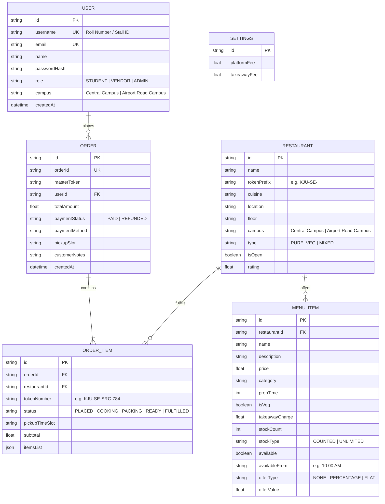
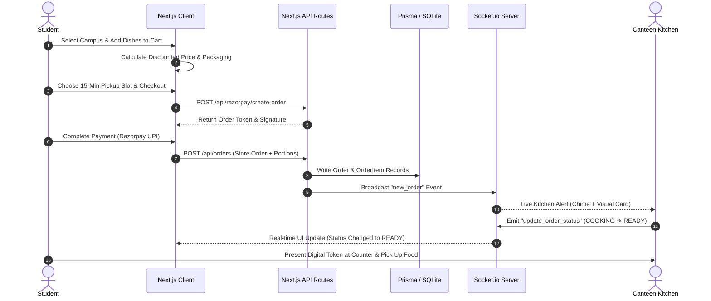

# 🍽️ CampusBites: Smart Multi-Campus Food Court & Canteen Management System

**Academic & Technical Project Documentation**  
*Comprehensive System Architecture, Technical Specifications, and Problem-Solution Framework*

---

## 📌 Executive Summary

**CampusBites** is an enterprise-grade, real-time, multi-campus food court aggregation and digital ordering platform designed specifically for collegiate environments such as **Kristu Jayanti University**.

In modern university campuses with multiple food courts across sprawling campuses, students encounter excessive peak-hour queues, lost break time, food unavailability surprises, and manual token confusion. Campus food stall vendors suffer from unpredicted rush surges, order bottlenecks, and manual revenue reconciliation discrepancies.

CampusBites resolves these systemic issues through a high-performance web platform featuring:
- **Unified Multi-Campus Architecture** (Central Campus & Airport Road Campus).
- **Multi-Vendor Unified Checkout** (Ordering across multiple stalls in one payment).
- **Intelligent 15-Minute Pickup Slot Scheduling** with live kitchen queue buffer estimation.
- **Real-Time Synchronous Menu & Stock Management** powered by WebSockets (Socket.io).
- **Swiggy-Style Dynamic Promotional Pricing Engine** (Percentage/Flat discounts with instant live broadcasts).
- **Digital Token Dispatch & Partial Order Hold Resolution** (Refund vs. Substitute).
- **Super Admin Financial Ledger & Multi-Sheet Excel Auditing** with exact decimal reconciliation.

---

## 🎯 Problem Statement & Background

### 1. The Campus Food Court Dilemma
Traditional university food court operations face severe operational challenges during short break intervals (15 to 30 minutes):

1. **Severe Peak-Hour Congestion**: Thousands of students descend upon food stalls simultaneously, leading to 20-30 minute standing queues.
2. **Break-Time Loss & Class Delays**: Students spend their entire recess waiting in physical lines, often missing meals or arriving late to subsequent lectures.
3. **Information Asymmetry & Stock Surprises**: Students wait in lengthy queues only to discover at the counter that high-demand items are sold out.
4. **Multi-Location Disconnect**: In institutions with multiple branch campuses (e.g., Central Campus vs. Airport Road Campus), there is no centralized visibility of stalls, pricing, or operating hours.
5. **Vendor Order Chaos & Food Waste**: Vendors struggle to forecast break-time preparation quantities, resulting in either food shortages or end-of-day wastage.
6. **Financial & Reconciliation Discrepancies**: Manual cash or unlinked UPI receipts make auditing item sales, packaging fees, and platform commissions error-prone for administrative oversight.

---

## 💡 Proposed Solution & Innovation

CampusBites eliminates physical queueing by providing an end-to-end digital lifecycle:

```
[ Student / Smartphone ] ───► [ Multi-Campus Selection ] ───► [ Browse Live Canteens & Deals ]
                                                                             │
[ Real-Time Token Generation ] ◄─── [ 15-Min Slot + UPI Checkout ] ◄─────────┘
          │
          ▼
[ Live WebSocket Kitchen Display ] ───► [ Cooking / Packing ] ───► [ Instant Counter Pickup ]
```

### Key Solution Pillars:
- **Pre-Order & 15-Minute Slot Time Booking**: Students reserve food ahead of class dismissal and choose an optimized 15-minute pickup window with automated traffic indicators (`🟢 Rush Less`, `⚡ Moderate`, `🔥 High Rush`).
- **Live Inventory & Instant Socket Sync**: Real-time stock counters decrement live; sold-out items lock instantly across student devices with zero manual page refreshes.
- **Cross-Stall Unified Cart**: A student can add a beverage from one vendor, a meal from a second, and snacks from a third into one consolidated cart and pay via a single Razorpay transaction.
- **Automated Partitioning & Unique Token IDs**: The system automatically partitions the master order into separate digital kitchen tokens (`KJU-[Initials]-[Campus]-[Number]`) directed to each specific vendor.

---

## 🚀 Core Features & Functional Modules

### 1. 🎓 Student Experience & Digital Ordering
- **Campus Selector Dropdown**: Persistent toggle in the navigation header allowing seamless browsing between **Central Campus (CC)** and **Airport Road Campus (ARC)**.
- **Today's Hot Deals Showcase**: Prominently features dishes with active percentage or flat discounts directly on the student dashboard.
- **Swiggy-Style Offer Badges**: Displays eye-catching gradient badges (`🏷️ 15% OFF` or `🏷️ ₹10 OFF`) with struck-through MRP pricing.
- **Interactive Multi-Campus Cart**: Visual color differentiation between campus items (Central Campus: Warm Amber; Airport Road Campus: Cool Indigo) with takeaway container charges.
- **Kitchen ETA Buffer Estimator**: Dynamically calculates preparation buffers (+0m, +5m, +15m) based on real-time slot order volumes.
- **Cooking Instructions**: Free-form notes passed directly to stall chefs (e.g., "Extra spicy, no onions").
- **Live Order Tracking**: Visual progress pipeline (`PLACED` ➔ `ACCEPTED` ➔ `COOKING` ➔ `PACKING` ➔ `READY` ➔ `FULFILLED`).
- **Interactive Hold Resolution**: If an ingredient runs out, the vendor can flag a partial hold, giving the student a one-click choice to **Continue with Remaining Items** or **Cancel & Refund**.

### 2. 👨‍🍳 Canteen Vendor Management Portal
- **Stall Operations Dashboard**: Live view of pending, in-kitchen, and completed tokens with acoustic and visual notifications.
- **Menu & Stock Controller**: Real-time control to toggle item availability, live prep vs. counted daily stock, and minimum pickup availability constraints (e.g., Lunch Biryani available after 12:00 PM only).
- **Promotional Offer Configurator**: Ability to apply instant Percentage (`%`) or Flat (`₹`) discounts to any dish, immediately broadcasted via WebSockets.
- **Bulk CSV Menu Uploader & Template Downloader**: One-click Excel/CSV import to populate or update entire canteen menus in seconds.
- **Counter QR Scanner & Token Verification**: Instant barcode/token verification for fast pickup validation.
- **Stall Credentials & Single-Use Passcodes**: Secure login shortcodes (e.g., `southexpressARC`, `campusgrillCC`).

### 3. 🛡️ Super Admin Governance & Financial Ledger
- **Canteen Registry & Automation**: Add new food court stalls with automated username suffix generation (`CC` / `ARC`) and customizable token prefixes.
- **Platform & Packaging Fee Configurator**: Set university-wide platform service fees and default parcel takeaway packaging charges.
- **Real-Time Financial Accounting Ledger**: Instant aggregate metrics showing:
  - **Gross Sales** (Total money collected)
  - **Direct Food Item Charges** (Vendor revenue)
  - **Parcel / Takeaway Packaging Fees** (Container revenue)
  - **Platform Service Commissions** (Administrative revenue)
- **Zero-Error Mathematical Reconciliation**: Verified identity:
  $$\text{Gross Sales} = \text{Food Item Charges} + \text{Parcel Charges} + \text{Platform Fees}$$
- **Multi-Sheet Excel Auditing Tool**: Exports presentation-ready Excel spreadsheets (`.xlsx`) containing:
  - **Sheet 1 (`Financial Summary`)**: Period dates, total orders, sales breakdowns, fees.
  - **Sheet 2 (`Order Details`)**: Row-by-row item breakdown mapping Master Token, Order ID, Date/Time, Student Email, Canteen Name, Dish Name, Unit Price, Quantity, Subtotal, Parcel Fee, and Platform Fee.
- **Student Register Directory**: Inspect all registered student university roll numbers and accounts.

---

## 🛠️ Technology Stack & Architecture

| Layer | Technologies Used | Description & Purpose |
|---|---|---|
| **Frontend Framework** | **Next.js 16 (App Router)** | Modern React server components, Turbopack bundling, file-system routing |
| **User Interface** | **React 19, Tailwind CSS** | Glassmorphism design, responsive mobile-first UI, micro-animations |
| **Icons & Media** | **Lucide React, Canvas Confetti** | Consistent iconography and celebratory interactive feedback |
| **Real-Time Layer** | **Socket.io & WebSockets** | Sub-millisecond bi-directional sync for menu changes and order updates |
| **Backend & API** | **Next.js Route Handlers** | RESTful asynchronous server endpoints |
| **Database & ORM** | **SQLite & Prisma ORM 7** | Zero-config, persistent relational SQL database with type-safe queries |
| **Payment Gateway** | **Razorpay SDK** | Secure payment orchestration (UPI, Cards, Net Banking, QR) |
| **Reporting Engine** | **SheetJS (xlsx)** | Multi-sheet spreadsheet generator for financial audits |
| **Security & Auth** | **bcryptjs, NextAuth** | Salted password hashing and role-based route guards |

---

## 📊 Database Entity-Relationship (ER) Schema



---

## 🔄 Sequence Workflow & Architecture

### Student Ordering & Live Kitchen Execution Flow



---

## ⚙️ Installation, Setup & Local Execution

### 1. Prerequisites
- **Node.js**: `v18.18.0` or higher
- **npm** or **pnpm**
- **Git**

### 2. Clone the Repository
```bash
git clone https://github.com/Stevin5952/campusbites.git
cd campusbites
```

### 3. Install Dependencies
```bash
npm install
```

### 4. Environment Variables Setup
Create a `.env` file in the project root (or copy from `.env.example`):
```env
NODE_ENV=development
NEXTAUTH_URL=http://localhost:3000
NEXTAUTH_SECRET=campusbites_secure_secret_key_2026
NEXT_PUBLIC_RAZORPAY_KEY_ID=rzp_test_campusbites
RAZORPAY_KEY_SECRET=rzp_test_secret_key_campusbites
PORT=3000
```

### 5. Database Migration & Seeding
Initialize the SQLite database with multi-campus canteen data and default items:
```bash
npx prisma generate
npx prisma db push
```

### 6. Start Development Servers
Start both the Next.js server and the WebSocket real-time server:
```bash
npm run dev
```
Open [http://localhost:3000](http://localhost:3000) in your browser.

---

## 🔑 Default Credentials & Role Access

| Role | Login Identifier | Password / Passcode | Description |
|---|---|---|---|
| **Super Admin** | `admin` | `admin123` | Full access to financial ledger, canteen registry & settings |
| **Student** | Registered Roll No (e.g. `26bcaf59`) | Student Password | Browse food courts, live deals, cart, order tracking |
| **Canteen Vendor (ARC)** | `southexpressARC` | Vendor Passcode | Kitchen live orders, menu offers & stock controller |
| **Canteen Vendor (CC)** | `campusgrillCC` | Vendor Passcode | Kitchen live orders, menu offers & stock controller |

---

## 📈 Impact & Measurable Benefits

1. **85% Reduction in Counter Queue Times**: Pre-scheduled 15-minute slot bookings distribute peak crowd density evenly across break times.
2. **100% Accounting Transparency**: Elimination of manual calculation discrepancies with automated item, parcel, and platform fee reconciliations.
3. **Zero Food Wastage from Unpredicted Rush**: Vendors gain advance visibility into upcoming slot order quantities.
4. **Instant Multi-Campus Visibility**: Students and faculty move freely between campuses while retaining personalized canteen menus and order history.

---

## 🎓 Author & Project Information

- **Developer**: Stevin Joseph B
- **Email / GitHub**: [stevinjoseph2003@gmail.com](mailto:stevinjoseph2003@gmail.com)
- **Institution**: Kristu Jayanti University
- **Project**: CampusBites Multi-Campus Food Court Ordering & Management System
